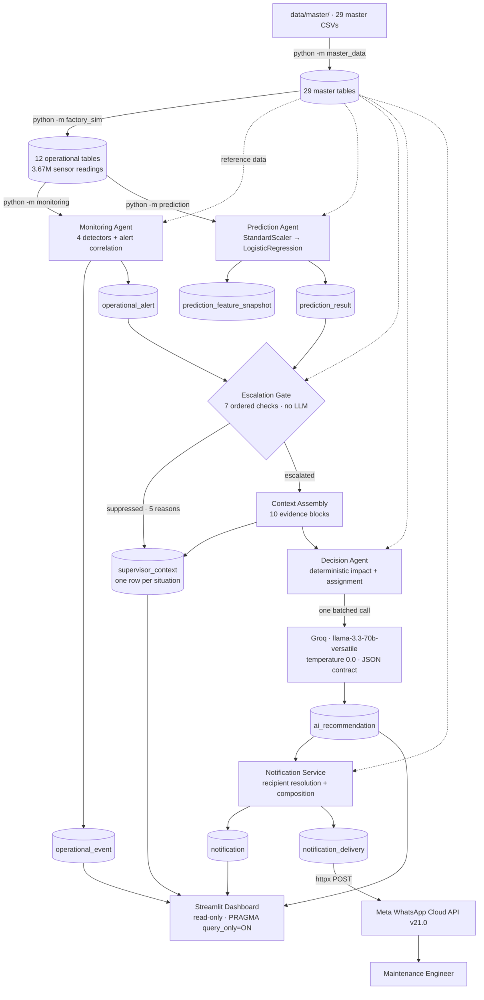
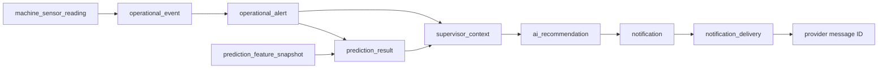

# FactoryFlow AI

**An AI-powered predictive maintenance decision support system for manufacturing operations.**

FactoryFlow AI watches machine telemetry, correlates what it detects into severity-ranked alerts, scores failure risk with a machine learning model, decides deterministically which situations are worth a human's attention, reasons about those with an LLM, and delivers an actionable recommendation to the engineer who has to act on it — with a complete evidence trail from the originating sensor reading to the delivered message.


---

## Table of Contents

- [Overview](#overview)
- [The Problem](#the-problem)
- [The Solution](#the-solution)
- [Key Features](#key-features)
- [System Architecture](#system-architecture)
- [End-to-End Workflow](#end-to-end-workflow)
- [Why Both ML and an LLM](#why-both-ml-and-an-llm)
- [Component Architecture](#component-architecture)
- [Machine Learning Pipeline](#machine-learning-pipeline)
- [Escalation Gate](#escalation-gate)
- [Decision Agent](#decision-agent)
- [Notification Pipeline](#notification-pipeline)
- [Example Alert](#example-alert)
- [Streamlit Dashboard](#streamlit-dashboard)
- [Traceability](#traceability)
- [Data and Database](#data-and-database)
- [Master Data](#master-data)
- [Factory Simulation](#factory-simulation)
- [Technology Stack](#technology-stack)
- [Project Structure](#project-structure)
- [Installation](#installation)
- [Environment Configuration](#environment-configuration)
- [Running the Project](#running-the-project)
- [System Metrics](#system-metrics)
- [Verification](#verification)
- [Known Limitations](#known-limitations)
- [Future Improvements](#future-improvements)
- [Engineering Highlights](#engineering-highlights)

---

## Overview

FactoryFlow AI is a **decision support system**, not a control system. It observes, predicts, reasons and advises. It never writes a setpoint, never actuates machinery, and never acts without a human. There is no control path in the architecture — the recommendation table has no column that could hold a machine setpoint, which is a structural guarantee rather than a convention.

The system runs as a set of command-line stages against a single SQLite file, plus a read-only Streamlit dashboard over the same file. There is no server, no message broker, no scheduler and no agent framework. Coordination happens through the database and through one orchestrator that calls four components in order.

Telemetry comes from a physics-informed factory simulator included in this repository. Every downstream component reads from the database rather than from the simulator, so the simulator is a substitutable data source rather than a shortcut baked into the design.

**Scale:** 114 Python modules across 9 packages (~27,500 non-blank lines), a 53-table SQLAlchemy schema with 163 enforced foreign keys, and a 3.67M-row telemetry dataset generated from 29 master-data CSVs.

---

## The Problem

A single CNC machine sampling six parameters at 5–60 second intervals produces roughly 2,340 readings per hour. Eight machines over a month is millions of rows. That volume creates four distinct problems, and they need four different solutions:

1. **Signal extraction.** Almost every reading is unremarkable. Finding the few that matter means comparing each against limits that differ per machine type, per parameter, and per threshold profile.
2. **Early detection.** Threshold crossings report a condition that has already arrived. A bearing degrading over three days stays nominally "in range" until it suddenly is not, so risk has to be inferred from trend and accumulated history, not just current value.
3. **Prioritisation.** Once conditions are detected, most do not warrant waking anybody. Alerting on all of them produces alert fatigue; alerting on none produces missed failures.
4. **Actionability.** A probability of `0.87` is not something a maintenance engineer can act on. Someone still has to determine the likely cause, who should respond, which spare part is needed, how long the repair will take, what it costs, and by when it must happen.

**What this system explicitly does not claim:** it does not guarantee zero downtime, does not guarantee that failures are prevented, does not replace maintenance engineers, does not control machines, and does not produce perfectly accurate predictions. It produces evidence-backed recommendations for a human to judge.

---

## The Solution

Four stages, each answering one question, each using the cheapest technique that can answer it:

| Stage | Question | Technique |
|---|---|---|
| **Monitoring** | What is happening right now? | Deterministic threshold comparison against master-data limits |
| **Prediction** | How likely is a failure, and when? | Logistic regression over an engineered feature vector |
| **Escalation** | Does this warrant a human's attention? | Deterministic rules read from the database |
| **Decision** | What should the team actually do? | One batched LLM call over pre-computed evidence |

The ordering matters economically. In the verified run, escalation evaluated 16 alerts and passed exactly one to the LLM. Suppression cost 1–6 ms per alert; escalation cost 1,410 ms. That gate is what keeps LLM usage bounded and is the most consequential design decision in the pipeline.

---

## Key Features

| Capability | Implementation |
|---|---|
| **Physics-informed factory simulation** | Seeded, reproducible generation of telemetry, production, quality, maintenance and inventory history across 12 tables, with interval-exact sampling driven entirely by master data |
| **Rule-based condition monitoring** | Four detectors (machine, production, quality, inventory) comparing against per-machine threshold profiles, correlating detections onto severity-ranked alerts with a full lifecycle |
| **ML failure risk scoring** | One logistic-regression pipeline per machine category over an engineered feature vector, with persisted feature snapshots and version-pinned artifacts |
| **Deterministic escalation gate** | Seven ordered checks driven by database business rules, including per-line probability overrides, a severity floor, duplicate convergence and recipient rate limiting |
| **Evidence-grounded LLM reasoning** | One batched Groq call at temperature 0.0 with a fixed seed, JSON response mode and a five-field output contract that rejects partial responses |
| **Business impact computed deterministically** | Downtime cost, units at risk, repair duration, deadline, priority band, team, engineer and spare part all derived from master data before the model is called |
| **WhatsApp delivery** | Meta WhatsApp Cloud API v21.0 over `httpx`, with recipient resolution from master data, a 13-code provider error map and per-attempt delivery records |
| **End-to-end traceability** | Real foreign keys from sensor reading through event, alert, prediction, context, recommendation, notification and delivery, with human-readable codes at every stage |
| **Auditable suppression** | A row is written for every suppressed alert, insufficient snapshot and unsent notification, each with a recorded reason |
| **Read-only operations dashboard** | Seven Streamlit pages with cross-page drill-down, database-driven filters and write protection enforced by `PRAGMA query_only = ON` |
| **Configuration as data** | 29 master CSVs and 17 business rules define thresholds, costs, severities, escalation policy and routing — changing plant policy needs no code change |
| **Schema integrity** | 53 tables, 163 foreign keys with `RESTRICT` as the default delete rule, WAL journaling and a nine-step startup verification that raises on first failure |

---

## System Architecture



Master data is reference input to every stage — thresholds, failure modes, costs, severities, recipients and business rules all come from database rows rather than code constants.

---

## End-to-End Workflow

Nothing in this system is scheduled. There is no background thread, no timer and no loop that owns the process — a cycle runs when a caller runs it.

```
data/master/*.csv
      │  python -m master_data <db> data/master
      ▼
29 master tables ────────────── reference data for every later stage
      │  python -m factory_sim <db> [hours] [seed]
      ▼
12 operational tables · machine_sensor_reading, cycle_history, production_*,
quality_*, scrap_record, inventory_movement, maintenance_*
      │  python -m monitoring <db> [cycles]
      ▼
  1. refresh suppression   (setup / planned downtime / under repair)
  2. detect (READ-ONLY)    machine · production · quality · inventory
  3. correlate and write   events attach to a found-or-created alert
  4. lifecycle             suppress · escalate unacknowledged · resolve
      ▼
operational_event ──> operational_alert
      │  python -m prediction <db> train      (fit one model per machine category)
      │  python -m prediction <db> predict    (load artifacts; never fits)
      ▼
prediction_feature_snapshot ──> prediction_result
      │  escalation gate — deterministic, no LLM
      ▼
  ┌─ suppressed_insufficient_data ──────────┐
  ├─ suppressed_maintenance_in_progress     │  a supervisor_context row is
  ├─ suppressed_below_threshold             ├─ written for EVERY outcome.
  ├─ suppressed_duplicate                   │  There is no silent path.
  ├─ suppressed_rate_limited ──────────────┘
  └─ escalated ──> context assembly ──> Decision Agent ──> Groq
                                              ▼
                                      ai_recommendation
                                              ▼
                          notification (one row per recipient,
                                        suppressed ones included)
                                              ▼
                          notification_delivery ──> Meta WhatsApp Cloud API
```

`python -m notification <db>` is the end-to-end entry point: it drives monitoring, prediction, the escalation gate, the Decision Agent and then delivery.

---

## Why Both ML and an LLM

This separation is the core architectural argument of the project.

**Machine learning answers "how likely is this failure condition?"** A logistic regression over 58 engineered features produces a probability and a horizon. It is cheap, deterministic, inspectable, and returns per-feature contributions.

**Deterministic rules answer "does this situation require reasoning?"** Threshold comparisons against `business_rule` rows decide escalation. No LLM is involved, because deciding what deserves attention is a threshold comparison, and threshold comparisons belong in deterministic code where they are auditable and free.

**The LLM answers "what should the maintenance team do about it?"** It produces a root-cause classification chosen from the failure modes declared for that machine type, plus a recommended action, a recovery plan and a reasoning narrative in operational language.

The boundary is enforced rather than merely intended:

- **Every number in a recommendation is computed before the LLM is called.** Downtime cost, units at risk, repair duration, deadline, priority band and engineer assignment are arithmetic over database values, passed to the model as settled fact.
- **The model cannot invent a root cause.** It selects from a supplied candidate list, and both the offered candidates and the returned choice are persisted alongside a `within_declared_modes` flag.
- **The model never re-estimates risk.** Failure probability is quoted from `prediction_result` by reference. `ai_recommendation` has no column that could hold a probability.

Using an LLM for risk estimation, or a threshold rule for business-impact analysis, would both be architectural errors in this design.

---

## Component Architecture

Three classes are named `Agent` in the implementation; the other two components are not, and this README does not call them agents.

| Component | Type | Single Responsibility | Owns (writes) |
|---|---|---|---|
| **Monitoring Agent** | `MonitoringAgent` | Detect operational conditions and correlate them into alerts | `operational_event`, `operational_alert` |
| **Prediction Agent** | `PredictionAgent` | Turn telemetry into a feature snapshot and a failure probability | `prediction_feature_snapshot`, `prediction_result` |
| **Supervisor** | `SupervisorOrchestrator` | Run the pipeline stages in order; decide escalation; assemble decision context | `supervisor_context` |
| **Decision Agent** | `DecisionAgent` | Compute business impact and assignment, then reason once with the LLM | `ai_recommendation` |
| **Notification Service** | `NotificationService` | Resolve recipients, compose messages, attempt delivery, record outcome | `notification`, `notification_delivery` |

**Single-writer table ownership.** All 53 tables have exactly one owning component, declared in that component's package docstring. No component writes a table it does not own. That constraint is what makes the evidence trail trustworthy: if a row exists, exactly one component could have written it.

The Supervisor exposes each stage as a named method — `run_monitoring`, `run_prediction`, `run_escalation`, `run_decision`, `run_notification`, `build_response` — and each stage result carries a `should_continue()` predicate, so a cycle that finds no live alert or no prediction ends early and records where it stopped.

---

## Machine Learning Pipeline

```
machine_sensor_reading + cycle_history + operational_event + master data
      │
      ▼  feature extraction over a 4-hour window
8 features per monitored parameter:
   latest_value · window_mean · window_min · window_max · window_stddev
   slope_per_hour · pct_above_normal_max · seconds_above_warning_limit
plus machine-level features:
   accumulated_operating_hours · hours_since_last_maintenance
   cycles_since_last_maintenance · pct_of_design_life · pct_of_mtbf_elapsed
   mean_cycle_deviation_pct · cycle_deviation_slope · event_count_24h
   attributed_scrap_count_24h · age_days
      ▼
prediction_feature_snapshot   ← written even when data is insufficient,
                                carrying is_sufficient_for_inference and a reason
      ▼
Pipeline([("scale", StandardScaler()), ("model", LogisticRegression())])
   solver=liblinear · C=1.0 · max_iter=1000
      ▼
failure_probability ──> risk severity band (BR-PRED-RISK-SEV-1..5)
      ▼
prediction_result   probability · horizon · model_version · feature contributions
```

One model is trained per **machine category**, so feature width follows the parameters that category actually monitors: 58 features for CNC machining, 26 for material handling.

**Training and inference are separate operations.** `train` fits and persists; `predict` loads persisted artifacts and never fits. Calling `predict` with no artifact raises `ModelNotTrainedError` rather than silently training one, because a prediction whose `model_version` depended on whether a file happened to exist would not be reproducible.

**Feature ordering is guarded, not assumed.** The ordered feature-name list is persisted inside the artifact next to the pipeline, the inference vector is built by iterating that list, and on load the persisted names are compared against the names freshly derived from master data — a mismatch raises. A silently reordered vector is therefore not possible.

**Reproducibility.** A feature snapshot plus a `model_version` reproduces the identical probability. This was verified: all three persisted predictions were recomputed from their stored snapshots and stored artifacts, matching to a delta of exactly `0.00e+00`.

**On model quality — read this before quoting any number.** The current artifacts were fitted on 60 and 30 examples, and the training code scores the same data it fits. **The reported ROC AUC and Brier scores are in-sample figures and are not evidence of predictive performance.** There is no held-out split in the current implementation. The pipeline plumbing — snapshot persistence, version pinning, reproducible inference, feature-order enforcement, insufficiency recording — is complete and verified; the evaluation is not. No accuracy, precision, recall or F1 claim is made anywhere in this repository.

---

## Escalation Gate

Entirely deterministic and entirely driven by `business_rule` rows. Seven checks in a fixed order:

| # | Check | Verdict if it fires |
|---|---|---|
| 1 | Is a prediction available, and is its snapshot sufficient? | `suppressed_insufficient_data` |
| 2 | Is a work order already open on the machine? | `suppressed_maintenance_in_progress` |
| 3 | Does probability meet the threshold (line-scoped, then plant default)? | `suppressed_below_threshold` |
| 4 | Does alert severity meet the severity floor? | `suppressed_below_threshold` |
| 5 | Does a recommendation already cover this alert? | `suppressed_duplicate` |
| 5b | Has this machine + prediction pair already escalated? | `suppressed_duplicate` |
| 6 | Have all eligible recipients exhausted their hourly allowance? | `suppressed_rate_limited` |
| 7 | — | **`escalated`** |

**A row is written for every evaluated situation, escalated or suppressed.** That is what lets the system answer the question a manager asks after a surprise incident — *"the machine was showing symptoms, why didn't the system tell me?"* — with a row and a rationale rather than a shrug. The expensive context document is built only on escalation.

**Check 5b is the interesting one.** A prediction is resolved per machine, so several live alerts on one machine all resolve to the same newest prediction. Without convergence on the machine-and-prediction pair, one degrading bearing holding four live alerts would produce four near-identical recommendations and four near-identical WhatsApp messages. The contributing alert is not lost — it keeps its own row, cites the context that covers it, and appears in that context's `related_alert_codes`.

Example verdicts recorded verbatim in the verified run:

> `escalated` — "Failure probability 0.9916 met the LN-01 threshold of 0.5500 (BR-ESC-PROB-LN01); severity SEV-2 met the SEV-2 floor (BR-ESC-SEV); Line criticality: critical; Bottleneck machine."

> `suppressed_duplicate` — "Context CTX-20260801-0002 has already escalated prediction PDN-20260801-0001 for MC-0101, so alert ALR-20260731-0006 is recorded as a further observation of that same predicted failure rather than escalated again."

> `suppressed_below_threshold` — "Failure probability 0.9916 met the LN-01 threshold of 0.5500 (BR-ESC-PROB-LN01), but alert severity SEV-4 sits below the SEV-2 floor (BR-ESC-SEV), so reasoning was not invoked."

Thresholds live in the database, including per-line overrides: the plant escalates at `0.70`, while the critical line `LN-01` escalates at `0.55`.

---

## Decision Agent

**Deterministic work happens first.** Before the model is called, the agent computes business impact from `business_rule` rows and master data, resolves the maintenance team, engineer, spare part and deadline, gathers persisted events, readings and the prediction's own feature attributions, and restricts root-cause candidates to the failure modes declared for that machine's type.

**Then one batched LLM call:**

| Setting | Value |
|---|---|
| Provider | Groq |
| Model | `llama-3.3-70b-versatile` |
| Temperature | `0.0` |
| Seed | fixed |
| Response format | `{"type": "json_object"}` |
| Calls per cycle | one, batched |
| Credential | `GROQ_API_KEY`, environment only |

**A five-field output contract is enforced:** `root_cause`, `root_cause_confidence`, `recommended_action`, `recovery_plan`, `reasoning_narrative`. Partial responses are rejected rather than backfilled — the parser collects missing references and raises. A `contract_complete` flag is persisted, and an incomplete recommendation must not be delivered as final.

**Confidence is capped by corroboration.** A `high` root-cause confidence requires evidence from at least two independent measurement paths.

**Observability is persisted, not logged and lost:** prompt tokens, completion tokens, generation duration, the contract flag, the offered candidate list and the returned classification all become columns on `ai_recommendation`.

In the verified run, a 337,601-character context document was compressed into a 2,540-token prompt, returning 395 completion tokens in 3,200 ms.

---

## Notification Pipeline

```
ai_recommendation
      ▼
recipient resolution   active · alert severity ≥ recipient's minimum · line in scope
      ▼                (all from notification_recipient master data)
composition            subject · body · measurements · horizon · probability
      ▼                deadline · downtime · reference IDs
notification           ONE ROW PER ELIGIBLE RECIPIENT — including suppressed ones
      ▼
notification_delivery  one row per channel attempt
      ▼                httpx POST {api_base}/{phone_number_id}/messages
Meta WhatsApp Cloud API v21.0    30s timeout · 4096-char cap · bearer auth
      ▼
  success ──> delivery_status = "sent", provider message ID persisted
  failure ──> mapped through a 13-code Meta error table
```

**A row is written even when nothing is sent.** In the verified run, four recipients were eligible and only three had WhatsApp enabled; the fourth was recorded as `is_suppressed=1` with reason `channel_unavailable`. Without that row, "was the plant manager told?" would be answered by the absence of a row, and absence is ambiguous between deliberately suppressed, never composed, and lost to a bug.

**Delivery status is deliberately honest about what it knows:**

| State | Meaning | Observable here? |
|---|---|---|
| **composed** | A `notification` row exists | Yes |
| **accepted / sent** | Meta returned success and issued a message ID | **Yes** |
| **delivered** | The message reached the handset | **No — requires a webhook receiver, which is not implemented** |
| **read** | The recipient opened it | **No** |

The schema and the confirmation code path both exist (`delivered_at`, `confirm_delivery`), but there is no inbound webhook, so `delivered_at` remains `NULL` and the system does not claim delivery. `sent` is the strongest status this architecture can honestly report.

`delivery_channel` includes `email` in its vocabulary, but **only the WhatsApp sender is implemented.**

---

## Example Alert

The actual message produced by the composer, with the recipient number and provider message ID withheld:

```
🚨 FactoryFlow AI Alert

Machine                MC-0101
Severity               SEV-1
Failure                Bearing Degradation
Failure Probability    99.16%
Recommended Action     The Housing Rough Mill's vibration velocity of 2.00 mm/s
                       and temperature of 60.4 °C indicate bearing degradation.
                       Intervening now is worthwhile to prevent a critical
                       failure. Engineer <name> and the MTM-MECH team should
                       inspect the bearing and measure its vibration and
                       temperature before the current batch ends. …
Deadline               1 Aug 2026, 5:15 AM
Estimated Downtime     4 h 15 min (255 min)
Reference              REC-20260801-0001
Prediction Horizon     8 hours
Prediction Reference   PDN-20260801-0001
```

**Presentation formatting is applied at the boundary, and the raw values are preserved.** The stored recommendation text contains `2.0025 mm/s` and `60.353°C`; the composer rewrites measurements to display precision (`2.00 mm/s`, `60.4 °C`) without altering what is stored. Timestamps are stored in UTC and rendered in the plant's timezone. The long action text is truncated at a channel-specific limit.

The dashboard imports the same formatting functions the message uses, so the two surfaces cannot disagree about a number.

---

## Streamlit Dashboard

```bash
streamlit run dashboard/app.py
```

Seven pages, grouped in the sidebar by the question being asked:

| Group | Page | What it answers |
|---|---|---|
| Operations | **Overview** | Plant health, the most urgent situation, whether each pipeline stage ran |
| Operations | **Machines** | Per-asset state, live risk, sensor trends against declared healthy envelopes |
| Intelligence | **Alerts** | Every correlated condition, its severity, and the gate's recorded verdict |
| Intelligence | **Predictions** | Probability, horizon, model version, feature attributions |
| Intelligence | **AI Recommendations** | Diagnosis, action, recovery plan and reasoning, in full |
| Communication | **Notifications** | What was composed, what was suppressed and why, what the provider accepted |
| Traceability | **Evidence** | The persisted basis for a decision and the reference chain |

**Read-only by construction, enforced at the connection.** Every dashboard connection sets `PRAGMA query_only = ON`, so SQLite itself refuses any write — a future edit that tried to write would fail loudly at the database rather than succeed quietly. Sessions roll back on every path, and the dashboard deliberately does not call the schema-creating initialiser. No page imports an agent, loads a model, or contacts a provider. **Refreshing clears the read cache and nothing else:** it cannot run the simulator, train a model, call Groq or send a message.

Other implemented behaviour: seven global filters whose vocabularies are read from the database rather than hard-coded; cross-page drill-down (alert → machine → prediction → recommendation → evidence) where a link appears only when the underlying foreign key exists; tiered caching with short TTLs for live data and longer TTLs for reference data; trend queries capped and downsampled so charts over millions of rows stay responsive; and Altair charts plotting readings against each parameter's declared normal band. Operators are never shown a traceback — database faults render as a plain-language screen with technical detail behind a disclosure.

The dashboard binds to `127.0.0.1` and **has no authentication**. See [Known Limitations](#known-limitations).

---

## Traceability

Every recommendation can be traced back to the telemetry that produced it, through real foreign keys:



Each stage carries a human-readable code, so a chain is legible in a query result:

```
reading 4679  →  EVT-20260731-0054  →  ALR-20260731-0003
              →  PDN-20260801-0001  (snapshot FSN-20260801-00001)
              →  CTX-20260801-0002
              →  REC-20260801-0001
              →  NTF-20260801-00001..00004
              →  3 delivery rows, status "sent"
```

Three design choices make the chain able to answer *negative* questions too:

- A **feature snapshot is written even when the data is inadequate**, carrying an insufficiency reason.
- A **`supervisor_context` row is written for every evaluated situation**, suppressed or not, with the rule that decided it.
- A **`notification` row is written for every eligible recipient**, suppressed or not, with the reason.

162 of the 163 foreign keys are `RESTRICT`, so a cited row cannot be deleted out from under the chain. The single exception is `operational_event.triggering_reading_id`, which is `SET NULL` so that purging old telemetry degrades a citation to "reading no longer retained" rather than orphaning it silently.

---

## Data and Database

**Runtime database: SQLite**, accessed through SQLAlchemy 2.0's default `pysqlite` dialect — Python's standard-library `sqlite3`. There is no third-party driver and no server to run.

| Aspect | Detail |
|---|---|
| Tables | 53, mapped with the SQLAlchemy 2.0 declarative ORM |
| Foreign keys | 163 (162 `RESTRICT`, 1 `SET NULL`) |
| Explicit unique indexes | 8, including partial uniques that prevent duplicate live alerts and runs |
| Journal mode | WAL, so the dashboard can read while a writer commits |
| Enforced per connection | `PRAGMA foreign_keys = ON`, `synchronous = NORMAL` |
| Busy timeout | 30 s |
| Domains | Master (29 tables), Operational (22), System (2) |

`PRAGMA foreign_keys` is applied through a `connect` event hook rather than once at startup, because it is per-connection, does not persist in the file, is a no-op inside a transaction, and fails silently — without the hook all 163 foreign keys are declared and inert.

**Startup verification.** Bringing the database up runs a nine-step check — connectivity, mapper registration, foreign-key enforcement read from a *pooled* connection, journal mode, busy timeout, table presence, `integrity_check`, `foreign_key_check`, and per-table readability — and raises on the first failure rather than logging it. An existing database is never re-created, reset or dropped.

Sessions use one transaction boundary per scope, with commit on success, rollback on any exception, and close on every path.

**About PostgreSQL:** this repository contains a PostgreSQL schema **design document** (`FACTORY_POSTGRESQL_DATABASE_SCHEMA.md`). It is a design artifact for a possible future migration. **PostgreSQL is not used at runtime and no PostgreSQL driver is installed.** Likewise, Alembic is referenced in ORM docstrings as the intended production migration owner, but no Alembic configuration or migration directory exists in this repository.

### Getting a database

**The generated SQLite database is not committed to GitHub** — it is gitignored, along with its WAL sidecars, because a populated run is hundreds of megabytes of regenerable output. You create your own local database by running the pipeline stages in order; see [Running the Project](#running-the-project). The schema itself is versioned two ways: as the SQLAlchemy models in `models/`, and as standalone DDL in `database/factoryflow_sqlite_schema.sql`.

---

## Master Data

29 CSV files in `data/master/` define the factory. They are loaded through a dedicated pipeline that validates structure, validates each record against the schema, detects duplicates, resolves foreign keys, inserts in a dependency-safe order, and verifies the result afterwards.

Verified entities include: **plant**, plant areas, departments, shifts, **production lines**, products and line capabilities, **machine categories**, **machine types**, **machines**, **machine parameters**, machine-type parameter bindings, **machine-type failure modes**, maintenance schedules, **failure categories**, **severity levels**, **alert threshold profiles** and **threshold rules**, **business rules**, **maintenance teams**, **engineers**, workers and roles, **notification recipients**, inventory items and locations, suppliers, customers, and a bill of materials.

**Master data is not decoration — it is the system's configuration.** The simulator has no free parameters: sampling intervals and healthy envelopes come from machine-type parameter rows, possible failures and warning periods from failure-mode rows, production rates from line capabilities, material from the bill of materials, maintenance intervals from schedules, response targets from teams, part retrieval times from inventory locations, and the working calendar from shifts. Monitoring compares against threshold rules. Escalation reads business rules. The Decision Agent computes cost from business rules and restricts root causes to declared failure modes. Notification routing comes from recipient rows and severity floors.

The practical consequence: adding a machine, changing a threshold, adjusting an escalation probability or adding a notification recipient is a data change, not a code change.

---

## Factory Simulation

`factory_sim/` generates the operational history the rest of the pipeline consumes: machine state and state transitions, telemetry, production runs and cycle history, output counts and progress, quality inspections and scrap, inventory movement, and maintenance work records and activities — twelve tables in total.

**This is simulated data. There is no connection to physical machinery, no PLC integration and no OT network.** It exists so the pipeline is reproducible, testable and demonstrable without proprietary industrial equipment. Runs are seeded, so the same seed reproduces the same factory.

Two properties are worth calling out because they are what make the simulation useful rather than merely synthetic:

**Sampling is interval-exact.** A machine type declaring RPM and torque at 5 s, temperature and vibration at 10 s, power at 30 s and tool wear at 60 s yields 2,340 readings per hour. Over the generated 720-hour window that is 1,684,800 rows — matching the stored count exactly, with no rounding.

**A simulated failure reaches the database as symptoms, never as a conclusion.** Degradation arrives as drifting telemetry, lengthening cycle times and dimensional defects. The simulator writes no event and no alert. If it wrote pre-made events, the Monitoring Agent's detection logic would never be exercised by the data intended to test it.

The simulator also injects sensor faults, written with a quality flag rather than silently dropped, so the data-quality detectors and the feature pipeline's exclusion logic both have something real to handle.

---

## Technology Stack

Every entry below is imported by at least one module in this repository.

| Category | Technology | Where and why |
|---|---|---|
| Language | **Python 3.11** | Whole codebase |
| ORM | **SQLAlchemy 2.0** | 53 declarative models, typed mappings, connection event hooks |
| Database | **SQLite** (via stdlib `sqlite3` / `pysqlite`) | Runtime persistence, WAL mode |
| ML framework | **scikit-learn** | `Pipeline`, `StandardScaler`, `LogisticRegression` |
| Model | **Logistic Regression** (`liblinear`) | Failure probability per machine category |
| Preprocessing | **StandardScaler** | First pipeline step; scaler is persisted with the model |
| Model persistence | **joblib** | Versioned artifacts with the ordered feature list |
| Numerics | **NumPy** | Feature vector arithmetic, slopes, standard deviations |
| Data handling | **pandas** | Feature tables and chart frames |
| LLM provider | **Groq** | Single reasoning call per cycle |
| LLM model | **llama-3.3-70b-versatile** | Temperature 0.0, fixed seed, JSON output mode |
| HTTP client | **httpx** | Meta WhatsApp Cloud API transport |
| Messaging | **Meta WhatsApp Cloud API v21.0** | Notification delivery |
| Dashboard | **Streamlit** | The entire UI, single entry point |
| Charts | **Altair** | Sensor trend charts against declared normal bands |
| Configuration | **python-dotenv** | Reads `.env`; process environment takes precedence |
| Version control | **Git** | — |

**Deliberately not used.** No agent framework (no LangChain, LangGraph or LlamaIndex), no vector database, no embeddings, no RAG, no web framework, no message broker, no cache server, no container runtime and no orchestration platform. Orchestration is one class calling four components in sequence. This is a stated design choice, not an omission.

---

## Project Structure

```
FactoryFlow-AI/
│
├── models/                        # 35 files — the 53-table SQLAlchemy layer
│   ├── base.py                    #   declarative base and the single MetaData
│   ├── registry.py                #   imports every model so MetaData is complete
│   ├── session.py                 #   engine, pragmas, sessions, 9-step verification
│   ├── mixins.py  types.py
│   ├── enums/                     #   master, operational and system enumerations
│   ├── master/                    #   29 master tables
│   ├── operational/               #   22 operational tables
│   └── system/                    #   audit and health
│
├── master_data/                   # 10 files — CSV import, validation, verification
│   ├── seeder.py  datasets.py  csv_source.py
│   ├── validation.py  duplicates.py  importer.py  verification.py
│   └── errors.py
│
├── factory_sim/                   # 11 files — the factory simulation engine
│   ├── simulator.py               #   orchestrator
│   ├── machine_state.py  production.py  quality.py
│   ├── failure.py  maintenance.py  inventory.py
│   └── context.py                 #   shared clock, seeded RNG, master snapshot
│
├── monitoring/                    # 10 files — detection and alert correlation
│   ├── agent.py                   #   MonitoringAgent, one cycle
│   ├── machine.py  production.py  quality.py  inventory.py   # 4 detectors
│   ├── alerts.py                  #   correlation and alert lifecycle
│   └── context.py
│
├── prediction/                    # 7 files — features, model, inference
│   ├── agent.py                   #   PredictionAgent, train / predict
│   ├── features.py                #   feature extraction and ordered names
│   ├── model.py                   #   pipeline, artifact store, feature-order guard
│   └── context.py
│
├── supervisor/                    # 7 files — orchestration and escalation
│   ├── orchestrator.py            #   SupervisorOrchestrator, the stage methods
│   ├── gate.py                    #   the escalation gate, 7 ordered checks
│   ├── assembly.py                #   context document construction
│   └── context.py                 #   business-rule resolution
│
├── decision/                      # 9 files — evidence, impact, reasoning
│   ├── agent.py                   #   DecisionAgent
│   ├── evidence.py  impact.py  assignment.py
│   ├── reasoning.py               #   the Groq call and output contract
│   └── context.py
│
├── notification/                  # 8 files — composition, routing, delivery
│   ├── notifier.py                #   NotificationService
│   ├── compose.py                 #   message composition and formatting authority
│   ├── whatsapp.py                #   Meta WhatsApp Cloud API transport
│   ├── recipients.py  context.py
│   └── errors.py
│
├── dashboard/                     # 17 files — read-only Streamlit dashboard
│   ├── app.py                     #   entry point, navigation, filters
│   ├── services/                  #   all queries; PRAGMA query_only = ON
│   ├── views/                     #   the seven pages
│   ├── components/                #   charts and layout
│   └── styles/
│
├── data/master/                   # 29 master-data CSVs + DERIVED_VALUES.md
├── database/
│   └── factoryflow_sqlite_schema.sql
├── .streamlit/config.toml         # theme, error display, loopback binding
│
├── PROJECT_OVERVIEW.md            # architecture and scope reference
├── FACTORY_MASTER_DATA_DESIGN.md
├── FACTORY_OPERATIONAL_DATA_DESIGN.md
├── FACTORY_SQLALCHEMY_MODEL_SPECIFICATION.md
├── FACTORY_SQLITE_DATABASE_SCHEMA.md
├── FACTORY_POSTGRESQL_DATABASE_SCHEMA.md   # design artifact, not runtime
├── README.md
└── .gitignore
```

Not committed, by design: `.env`, the generated `*.db` files and their WAL sidecars, trained model artifacts, and `__pycache__`.

---

## Installation

### Prerequisites

- Python 3.11
- A Groq API key — only for the reasoning stage
- Meta WhatsApp Cloud API credentials — only for the delivery stage

The dashboard needs neither credential. It never calls Groq or Meta.

### 1. Clone

```bash
git clone https://github.com/Velayutham-S/FactoryFlow-AI.git
cd FactoryFlow-AI
```

### 2. Create a virtual environment

```bash
python -m venv .venv

# Windows
.venv\Scripts\activate

# macOS / Linux
source .venv/bin/activate
```

### 3. Install dependencies

**This repository does not currently include a `requirements.txt` or `pyproject.toml`, so dependencies are installed explicitly.** These are the exact packages the code imports:

```bash
pip install sqlalchemy pandas numpy scikit-learn joblib streamlit altair groq httpx python-dotenv
```

Versions this project was developed and verified against:

```
sqlalchemy 2.0.50   pandas 2.3.3    numpy 2.4.4     scikit-learn 1.8.0
joblib 1.5.3        streamlit 1.58.0  altair 6.0.0  groq 1.5.0
httpx 0.28.1        python-dotenv 1.2.2
```

---

## Environment Configuration

Create a `.env` file in the repository root. **`.env` is listed in `.gitignore` and must never be committed.** Use placeholders like the ones below — never commit real values.

```env
# Decision Agent — reasoning
GROQ_API_KEY=your_groq_api_key_here

# Notification Service — Meta WhatsApp Cloud API
WHATSAPP_ACCESS_TOKEN=your_meta_access_token_here
WHATSAPP_PHONE_NUMBER_ID=your_sender_phone_number_id_here
WHATSAPP_PHONE_NUMBER=recipient_number_without_country_code
WHATSAPP_DEFAULT_COUNTRY=country_calling_code
```

Variables read by the code:

| Variable | Used by | Required |
|---|---|---|
| `GROQ_API_KEY` | Decision Agent | Yes, for reasoning |
| `WHATSAPP_ACCESS_TOKEN` | Notification Service | Yes, for delivery |
| `WHATSAPP_PHONE_NUMBER_ID` | Notification Service | Yes — the sender ID in the endpoint |
| `WHATSAPP_RECIPIENT_NUMBER` | Notification Service | Destination; `WHATSAPP_PHONE_NUMBER` is accepted as an alternative name |
| `WHATSAPP_DEFAULT_COUNTRY` | Notification Service | Optional — used to normalise a local number |
| `WHATSAPP_API_BASE` | Notification Service | Optional — defaults to Graph API v21.0 |
| `WHATSAPP_TIMEOUT_SECONDS` | Notification Service | Optional — defaults to 30 |
| `FACTORYFLOW_DB` | Dashboard | Optional — otherwise the largest `.db` in the repository is used |

Credentials are read from the process environment first, then from `.env`, and a missing required value raises a configuration error **before** any notification row is written. No credential name appears anywhere in `dashboard/`, and no secret appears in any source file.

---

## Running the Project

Each stage has its own entry point, and they run in order against one database file.

> **The database path must be absolute.** A relative path is rejected deliberately, because it would resolve against the working directory and the database found would depend on where the process was started.

```bash
# 1. Create and seed the 29 master tables
python -m master_data /abs/path/factoryflow.db data/master

# 2. Generate operational history  (args: hours, seed)
python -m factory_sim /abs/path/factoryflow.db 720 20260731

# 3. Detect conditions and correlate them into alerts
python -m monitoring /abs/path/factoryflow.db 1

# 4. Train one model per machine category, then score
python -m prediction /abs/path/factoryflow.db train
python -m prediction /abs/path/factoryflow.db predict

# 5. Run the full pipeline and deliver
#    Drives monitoring, prediction, escalation, the Decision Agent, then delivery.
#    Sends REAL WhatsApp messages when credentials are configured.
python -m notification /abs/path/factoryflow.db 1
```

Two additional entry points are available for running stages in isolation:

```bash
python -m supervisor /abs/path/factoryflow.db 1   # pipeline without delivery
python -m decision   /abs/path/factoryflow.db     # reasoning only
```

### Start the dashboard

```bash
# Windows
set FACTORYFLOW_DB=C:\abs\path\factoryflow.db

# macOS / Linux
export FACTORYFLOW_DB=/abs/path/factoryflow.db

streamlit run dashboard/app.py
```

The dashboard opens on `127.0.0.1` and is read-only. It will not create a database — if it cannot find one it says so and stops rather than showing an empty shell.

### What to expect

Each stage prints a summary of what it wrote. Monitoring reports detections, events written and alerts opened, broken down by category and type. Prediction reports the artifacts it fitted or the predictions it recorded. The supervisor reports where the cycle stopped. Notification reports what was composed, suppressed and transmitted.

> **Note on step 4 with fresh data.** Training needs confirmed failure labels. Simulated maintenance records do not always carry a confirmed failure category, in which case there are no positive labels and training stops with an explicit insufficiency error rather than fitting a degenerate model. This is expected behaviour, not a crash — see [Known Limitations](#known-limitations).

---

## System Metrics

These are measured figures. Two categories, kept separate because they mean different things.

### Dataset scale — the generated 30-day operational window

| Table | Rows |
|---|---:|
| `machine_sensor_reading` | 3,672,000 |
| `cycle_history` | 91,882 |
| `production_count` | 7,342 |
| `production_progress` | 7,230 |
| `operational_event` | 6,564 |
| `machine_state_transition` | 1,884 |
| `scrap_record` | 1,714 |
| `quality_inspection_result` | 1,646 |
| `inventory_movement` | 1,081 |
| `production_run` | 249 |

Fleet: 8 machines across 6 machine types, 5 categories and 4 production lines, with 7 monitored parameters. Telemetry was generated for 3 of the 8 machines.

Detected event types: `rate_of_change_exceeded` 3,034 · `output_shortfall` 1,752 · `scrap_rate_exceeded` 1,744 · `sensor_out_of_range` 27 · `reorder_point_reached` 7.

### One verified pipeline run

**These are the results of a single verification run, not a throughput or production-capacity claim.**

| Stage | Result |
|---|---|
| Alerts evaluated by the gate | 16 |
| `supervisor_context` rows written | 16 — one per evaluated situation |
| Escalated | 1 |
| Suppressed | 15 — 9 insufficient data, 5 below threshold, 1 duplicate |
| LLM calls made | 1 |
| Recommendations produced | 1, with a complete output contract |
| Notifications composed | 4 — one per eligible recipient |
| Notifications suppressed | 1 — recipient had no WhatsApp channel |
| WhatsApp messages accepted by Meta | 3 |
| Messages confirmed delivered to a handset | **0 — no webhook receiver exists** |

Observed timings: context assembly 1,410 ms when escalating versus 1–6 ms when suppressing; LLM generation 3,200 ms for 2,540 prompt and 395 completion tokens; Meta API latency 2.3–5.5 s; ML inference under 15 ms.

---

## Verification

There is **no automated test suite in this repository** — no test framework, no test files, no CI. Verification was performed by running the real system and querying the resulting database. Reported honestly, this is what has and has not been established.

**Verified against the running system:**

- **Database integrity** — `PRAGMA integrity_check` returns `ok`; `PRAGMA foreign_key_check` returns zero violations across 163 foreign keys.
- **Master data** — all 29 tables populate, and the full foreign-key chain resolves from a machine through its type, category, line, area, plant, threshold profile and declared failure modes.
- **Monitoring** — a single case traced end to end: a stored sensor reading, the event it triggered, and the alert that event was correlated onto, with the event's breached limit matching the threshold rule in master data.
- **Prediction** — all three persisted predictions recomputed from their stored feature snapshots and stored artifacts, matching the persisted probabilities to a delta of `0.00e+00`. The feature-order guard was confirmed to raise on mismatch.
- **Escalation** — 16 evaluated situations produced 16 rows with no silent path. Four verdict types were exercised on real data, including duplicate convergence and the severity floor. Two verdict types (`suppressed_maintenance_in_progress`, `suppressed_rate_limited`) are implemented but were not triggered by this dataset.
- **Decision output quality** — every factual claim in the generated recommendation was cross-checked against master data: engineer name, team, spare part code, part lead time, retrieval time, repair duration and downtime cost all trace to database rows, and the cited measurements match the feature snapshot exactly. The root cause was one of the failure modes declared for that machine type. **No invented machine ID, prediction ID, reference ID, measurement, name, part or cost was found.**
- **Notification composition** — message bodies were scanned for credentials, bearer tokens, tracebacks, SQL and raw Python objects; none were present. Measurement rounding, duration formatting and UTC-to-plant-timezone conversion were each confirmed against stored values.
- **Meta WhatsApp Cloud API** — a real message was sent through the production transport with real credentials. Meta returned success and issued a message ID. **This proves API acceptance, not handset delivery.**
- **Dashboard** — the app boots and serves; all twenty service functions backing the seven pages return correct data; every aggregate shown on the Overview page matches an independent SQL query. All pages load in under a second cold and are cached thereafter. A write-path scan across all dashboard modules found no write, no agent import, no model load and no provider call.
- **Error handling** — verified to fail loudly with actionable messages for a relative database path, a missing database, a missing model artifact, a missing Groq key and missing WhatsApp credentials.

**Not verified:** browser-level interaction testing of dashboard controls; message delivery or read status; any held-out model evaluation.

---

## Known Limitations

Stated plainly, because they affect how the system should be interpreted.

1. **Model evaluation is in-sample.** The training routine scores the same data it fits, on 60 and 30 examples. The recorded ROC AUC and Brier scores are training-set figures and are **not** evidence of predictive performance. No held-out split is implemented. The pipeline around the model is complete and reproducible; the evaluation is not.

2. **Fresh simulated data may not yield trainable labels.** Label construction requires a confirmed failure category on maintenance records. When simulated maintenance records do not carry one, there are no positive examples and training stops with an explicit insufficiency error rather than fitting a degenerate model. Guards require a minimum number of examples and a minimum per class. Expect this on a freshly generated database.

3. **Delivery and read status cannot be observed.** There is no webhook receiver, so `delivered_at` stays `NULL` and the confirmation code path is never invoked. The system reports `sent` and does not claim more.

4. **No automated test suite.** Verification is manual, as described above.

5. **No dependency manifest.** Dependencies are installed explicitly; there is no `requirements.txt` or `pyproject.toml` yet.

6. **The dashboard has no authentication.** It is read-only, so nothing can be altered through it, but every machine, alert, prediction and recommendation is readable by anyone who can reach the port. The server binds to `127.0.0.1` explicitly for this reason, since Streamlit's own default is to listen on all interfaces. For shared deployment, place it behind an authenticating reverse proxy rather than widening the bind address.

7. **Human response is not yet captured.** The table for recording what an engineer did about a recommendation exists and is owned by the dashboard, but the dashboard is read-only in this phase, so acknowledgement and outcome are not recorded. The evidence chain is complete from telemetry to provider acceptance, and absent from acceptance to human action.

8. **Telemetry covers 3 of the 8 configured machines**, so alerts on machines without telemetry are correctly suppressed as insufficient data.

9. **Data is simulated.** There is no connection to physical equipment.

10. **One event type in the vocabulary is intentionally unimplemented** because no specification defines its trigger, and inventing one would mean inventing a monitoring rule. `delivery_channel` similarly includes `email`, but only the WhatsApp sender is implemented.

---

## Future Improvements

Realistic next steps that follow from the limitations above, none of them implemented:

- **Held-out model evaluation** once a labelled failure history is available, replacing in-sample figures with honest generalisation metrics.
- **A webhook receiver** for Meta status callbacks, which would let `confirm_delivery` run and close the accepted → delivered → read gap.
- **A dependency manifest** and an automated test suite covering the deterministic stages.
- **Real telemetry ingestion**, substituting the simulator for a historian or OT feed behind the same database interface.
- **Authentication** in front of the dashboard for shared deployment.

---

## Engineering Highlights

For reviewers and technical interviewers — the decisions worth discussing, not a feature list.

**Deterministic gating in front of generative reasoning.** The most expensive stage runs last and least. Threshold logic decides what deserves attention; the LLM only explains what to do about the survivors. The cost asymmetry was measured, not assumed: suppression is roughly 250–1,400× cheaper than escalation.

**A structurally enforced ML/LLM boundary.** Risk quantification and language generation are separate stages with separate storage. The recommendation table has no probability column, so an LLM-invented confidence figure has nowhere to live; root cause is chosen from a supplied candidate list with the choice recorded; all arithmetic is computed before the call.

**An enforced LLM output contract.** Five required fields, one batched call, temperature zero with a fixed seed, JSON response mode, partial responses rejected rather than backfilled, and token counts, latency and a completeness flag persisted as columns.

**Configuration as data.** Thresholds, cost rates, severity bands, escalation probabilities with per-line overrides, and notification routing all live in database rows. Changing plant policy is a data change.

**Auditability that answers negative questions.** A row is written for every suppressed alert, every insufficient feature snapshot and every unsent notification, each with a reason — so "why didn't the system tell me?" has an answer.

**Single-writer table ownership.** Each of 53 tables has exactly one owning component. Combined with 163 enforced foreign keys and `RESTRICT` as the default delete rule, the evidence trail cannot develop holes silently.

**Read-only enforced at the connection, not by convention.** The dashboard sets `PRAGMA query_only = ON`, so a future edit that tried to write would fail at the database rather than succeed quietly.

**A single presentation authority.** Durations, timestamps, measurements, horizons and probabilities are formatted by one module, imported by both the notification composer and the dashboard, so the message and the screen cannot disagree while stored precision is preserved.

**Reproducibility as a contract.** A feature snapshot plus a model version reproduces an identical probability, verified to zero delta. Simulator runs are seeded. LLM decoding is deterministic.

**Honest status modelling.** `composed`, `sent`, `delivered` and `read` are distinct, and the system claims only what it can observe.

---

*FactoryFlow AI is a decision support system. It observes, predicts, reasons and advises. Every recommendation is a proposal for a human to judge, and the final decision belongs to the maintenance team.*
