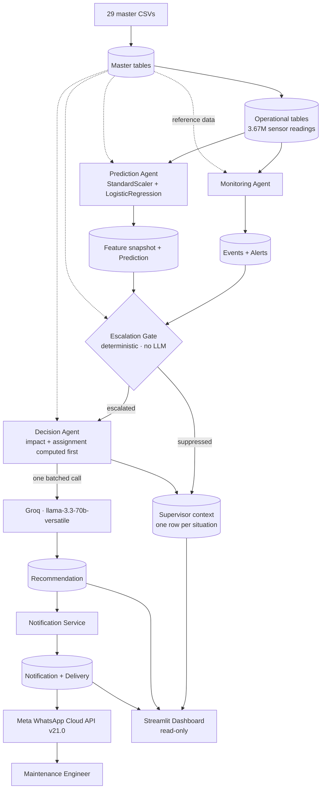

# FactoryFlow AI

**An AI-powered predictive maintenance decision support system for manufacturing operations.**

FactoryFlow AI watches machine telemetry, correlates what it detects into severity-ranked alerts, scores failure risk with a machine learning model, decides deterministically which situations deserve attention, reasons about those with an LLM, and delivers an actionable recommendation over WhatsApp — with a traceable evidence chain from the originating sensor reading to the delivered message.


## Overview

FactoryFlow AI is a **decision support system, not a control system.** It observes, predicts, reasons and advises. It never writes a setpoint and never acts without a human — there is no control path in the architecture.

The system runs as a sequence of command-line stages against a single SQLite file, plus a read-only Streamlit dashboard over the same file. There is no server, no message broker, no scheduler and no agent framework. Components coordinate through the database and through one orchestrator that calls them in order.

Telemetry comes from a physics-informed factory simulator included in the repository. Every downstream component reads from the database rather than from the simulator, so the simulator is a substitutable data source rather than a shortcut baked into the design.

**Scale:** 114 Python modules across 9 packages, a 53-table SQLAlchemy schema, and a 3.67M-row telemetry dataset generated from 29 master-data CSVs.

**The problem it addresses.** Six parameters sampled every 5–60 seconds across a fleet produces millions of rows, almost all unremarkable. Threshold crossings report conditions that have already arrived, while degradation over days stays nominally in range until it suddenly is not. Alerting on everything causes fatigue; alerting on nothing misses failures. And a probability of `0.87` is not actionable — someone still has to determine likely cause, responder, spare part, duration, cost and deadline. The system does **not** guarantee zero downtime, prevent failures, replace maintenance engineers, or produce perfect predictions.

**The approach.** Four stages, each answering one question with the cheapest technique that can answer it:

| Stage | Question | Technique |
|---|---|---|
| **Monitoring** | What is happening now? | Deterministic thresholds from master data |
| **Prediction** | How likely is a failure, and when? | Logistic regression over engineered features |
| **Escalation** | Does this deserve attention? | Deterministic rules read from the database |
| **Decision** | What should the team do? | One batched LLM call over pre-computed evidence |

Ordering matters economically. In the verified run the gate evaluated 16 alerts and passed exactly **one** to the LLM — suppression cost 1–6 ms per alert against 1,410 ms to escalate.

## Architecture



Master data is reference input to every stage — thresholds, failure modes, costs, severities, recipients and business rules are database rows, not code constants.

### Components

Three classes are named `Agent` in the implementation. The other two are not, and are not described as agents here.

| Component | Responsibility | Writes |
|---|---|---|
| **Monitoring Agent** | Detect operational conditions, correlate them into alerts | events, alerts |
| **Prediction Agent** | Turn telemetry into a feature snapshot and a failure probability | snapshots, predictions |
| **Supervisor** (orchestrator) | Run stages in order, decide escalation, assemble decision context | supervisor contexts |
| **Decision Agent** | Compute business impact and assignment, then reason once with the LLM | recommendations |
| **Notification Service** | Resolve recipients, compose messages, attempt delivery, record outcome | notifications, deliveries |

Each of the 53 tables has exactly one owning component, declared in that component's package docstring. No component writes a table it does not own — which is what makes the evidence trail trustworthy.

### Traceability

Every recommendation traces back to the telemetry that produced it through real foreign keys, with a human-readable code at each stage — `reading 4679 → EVT-20260731-0054 → ALR-20260731-0003 → PDN-20260801-0001 → CTX-20260801-0002 → REC-20260801-0001 → NTF-20260801-00001..4`. Three choices let the chain answer *negative* questions too: a feature snapshot is written even when data is inadequate, a context row is written for every evaluated situation, and a notification row is written for every eligible recipient — each carrying the reason it went no further.

## Why both ML and an LLM

This separation is the core architectural argument of the project.

- **Machine learning answers "how likely is this failure?"** A logistic regression over engineered features returns a probability, a horizon and per-feature contributions. Cheap, deterministic, inspectable.
- **Deterministic rules answer "does this need reasoning?"** Threshold comparisons against business-rule rows decide escalation. No LLM, because deciding what deserves attention is a threshold comparison, and those belong in auditable code.
- **The LLM answers "what should the team do?"** It produces a root-cause classification, a recommended action, a recovery plan and a reasoning narrative in operational language.

The boundary is **enforced, not merely intended**: every number in a recommendation is computed *before* the model is called and passed in as settled fact; the model selects a root cause from the failure modes declared for that machine type rather than inventing one; and it never re-estimates risk, because probability is quoted from the prediction row by reference and the recommendation table has no column that could hold one. Using an LLM for risk estimation, or a threshold rule for business-impact analysis, would both be architectural errors in this design.

## Machine learning pipeline

Telemetry, cycle history, events and master data are reduced over a rolling window into per-parameter statistics (level, spread, trend, time above limit) plus machine-level features (operating hours, design-life and MTBF consumption, cycle deviation, recent event and scrap counts, age). That vector is persisted as a **feature snapshot — written even when the data is insufficient, carrying the reason** — then passed through `Pipeline([("scale", StandardScaler()), ("model", LogisticRegression())])` to produce a failure probability, a risk severity band and a prediction record.

One model is trained **per machine category**, so feature width follows the parameters that category monitors — 58 features for CNC machining, 26 for material handling.

**Training and inference are separate.** `train` fits and persists; `predict` loads artifacts and never fits. Predicting with no artifact raises rather than silently training one, because a prediction whose model version depended on whether a file happened to exist would not be reproducible.

**Feature ordering is guarded.** The ordered feature-name list is persisted inside the artifact, the inference vector is built by iterating it, and on load the persisted names are compared against names freshly derived from master data — a mismatch raises.

**Reproducibility is verified.** All three persisted predictions were recomputed from their stored snapshots and artifacts and matched to a delta of exactly `0.00e+00`.

> **On model quality — read before quoting any number.** The current artifacts were fitted on 60 and 30 examples, and the training routine scores the same data it fits. **The recorded ROC AUC and Brier scores are in-sample and are not evidence of predictive performance.** No held-out split is implemented. The pipeline around the model — snapshot persistence, version pinning, reproducible inference, feature-order enforcement, insufficiency recording — is complete and verified; the evaluation is not. No accuracy, precision, recall or F1 claim is made anywhere in this repository.

## Escalation gate

Entirely deterministic and entirely driven by business-rule rows. Checks run in a fixed order and produce one of six verdicts: `escalated`, or suppressed for insufficient data, maintenance already in progress, below probability or severity threshold, duplicate coverage, or recipient rate limiting.

**A row is written for every evaluated situation, escalated or suppressed.** That is what lets the system answer the question a manager asks after a surprise incident — *"the machine was showing symptoms, why didn't the system tell me?"* — with a row and a rationale rather than a shrug. The expensive context document is assembled only on escalation.

Thresholds live in the database, including per-line overrides: the plant escalates at `0.70` probability while the critical line escalates at `0.55`. Recorded verbatim from the verified run:

> **escalated** — "Failure probability 0.9916 met the LN-01 threshold of 0.5500 (BR-ESC-PROB-LN01); severity SEV-2 met the SEV-2 floor (BR-ESC-SEV); Line criticality: critical; Bottleneck machine."

A duplicate check converges alerts onto the machine-and-prediction pair they describe, because several live alerts on one machine resolve to the same prediction — without it, one degrading bearing would produce four near-identical recommendations and four near-identical messages.

## Decision Agent

**Deterministic work happens first.** Business impact, responder assignment, spare part, deadline and the candidate root-cause list are all computed from master data before the model is called. Then one batched LLM call:

| Setting | Value |
|---|---|
| Provider / model | Groq · `llama-3.3-70b-versatile` |
| Temperature / seed | `0.0` / fixed |
| Response format | JSON object mode |
| Calls per cycle | one, batched |
| Credential | `GROQ_API_KEY`, environment only |

**A five-field output contract is enforced** — root cause, confidence, recommended action, recovery plan, reasoning narrative. Partial responses are rejected rather than backfilled, and a completeness flag is persisted. Confidence is capped by corroboration: a `high` root-cause confidence requires evidence from at least two independent measurement paths. Token counts, generation duration and the contract flag are stored as columns rather than logged and lost.

## Notification and WhatsApp

A recommendation resolves to recipients from master data (active, severity floor met, line in scope), a message is composed, **one notification row is written per eligible recipient**, and each delivery attempt is an `httpx` POST to the Meta WhatsApp Cloud API with the outcome recorded and provider errors mapped through a 13-code table.

**A row is written even when nothing is sent.** In the verified run four recipients were eligible but only three had WhatsApp enabled; the fourth was recorded as suppressed with reason `channel_unavailable`. Without that row, "was the plant manager told?" would be answered by the absence of a row, and absence is ambiguous between deliberately suppressed, never composed, and lost to a bug.

**Delivery status is honest about what it can observe:**

| State | Meaning | Observable? |
|---|---|---|
| composed | A notification row exists | Yes |
| accepted / sent | Meta returned success and issued a message ID | **Yes** |
| delivered | Reached the handset | **No — requires a webhook receiver, not implemented** |
| read | Recipient opened it | **No** |

The schema and confirmation code path exist, but with no inbound webhook the system reports `sent` and claims no more. The channel vocabulary includes email, but **only the WhatsApp sender is implemented.**

### Example alert

Actual composer output, with recipient and provider message ID withheld:

```
🚨 FactoryFlow AI Alert

Machine                MC-0101
Severity               SEV-1
Failure                Bearing Degradation
Failure Probability    99.16%
Recommended Action     The Housing Rough Mill's vibration velocity of 2.00 mm/s
                       and temperature of 60.4 °C indicate bearing degradation.
                       Engineer <name> and the MTM-MECH team should inspect the
                       bearing before the current batch ends. …
Deadline               1 Aug 2026, 5:15 AM
Estimated Downtime     4 h 15 min (255 min)
Reference              REC-20260801-0001
Prediction Horizon     8 hours
Prediction Reference   PDN-20260801-0001
```

Formatting is applied at the boundary and raw values are preserved: the stored text holds `2.0025 mm/s` and `60.353°C` while the composer renders display precision, and timestamps are stored in UTC and rendered in the plant timezone. The dashboard imports the same formatting functions, so the message and the screen cannot disagree about a number.

## Streamlit dashboard

```bash
streamlit run dashboard/app.py
```

| Group | Page | What it answers |
|---|---|---|
| Operations | **Overview** | Plant health, most urgent situation, whether each stage ran |
| Operations | **Machines** | Per-asset state, live risk, sensor trends against healthy envelopes |
| Intelligence | **Alerts** | Correlated conditions, severity, and the gate's recorded verdict |
| Intelligence | **Predictions** | Probability, horizon, model version, feature attributions |
| Intelligence | **AI Recommendations** | Diagnosis, action, recovery plan and reasoning, in full |
| Communication | **Notifications** | What was composed, what was suppressed and why, what was accepted |
| Traceability | **Evidence** | The persisted basis for a decision and its reference chain |

**Read-only by construction, enforced at the connection** rather than by convention, so an edit that tried to write would fail at the database instead of succeeding quietly. No page imports an agent, loads a model or contacts a provider. Refreshing clears the read cache and nothing else — it cannot run the simulator, train a model, call Groq or send a message.

Also implemented: database-driven filter vocabularies, cross-page drill-down where a link appears only when the underlying foreign key exists, tiered caching, downsampled trend charts over millions of rows, and plain-language error screens instead of tracebacks. The dashboard binds to `127.0.0.1` and **has no authentication** — see [Known limitations](#known-limitations).

## Technology stack

Every entry is imported by at least one module in this repository.

| Category | Technology |
|---|---|
| Language | **Python 3.11** |
| ORM | **SQLAlchemy 2.0** — declarative, typed mappings, connection event hooks |
| Database | **SQLite** via the standard-library driver, WAL journaling |
| ML | **scikit-learn** — `Pipeline`, `StandardScaler`, `LogisticRegression` (`liblinear`) |
| Model persistence | **joblib** — versioned artifacts carrying the ordered feature list |
| Numerics / data | **NumPy**, **pandas** |
| LLM | **Groq** · `llama-3.3-70b-versatile` |
| HTTP / messaging | **httpx** → **Meta WhatsApp Cloud API v21.0** |
| Dashboard | **Streamlit** + **Altair** |
| Configuration | **python-dotenv** |

**Deliberately not used:** no agent framework (no LangChain, LangGraph or LlamaIndex), no vector database, no embeddings, no RAG, no web framework, no message broker, no cache server, no container runtime, no orchestration platform. Orchestration is one class calling four components in sequence. This is a design choice, not an omission.

## Project structure

```
FactoryFlow-AI/
├── models/            # 53-table SQLAlchemy layer: base, registry, session, enums,
│                      #   master / operational / system domains
├── master_data/       # CSV import, validation, duplicate detection, verification
├── factory_sim/       # Simulation engine: state, production, quality, failure,
│                      #   maintenance, inventory
├── monitoring/        # Monitoring Agent: detectors, alert correlation and lifecycle
├── prediction/        # Prediction Agent: feature extraction, model store, inference
├── supervisor/        # Orchestrator, escalation gate, context assembly
├── decision/          # Decision Agent: evidence, impact, assignment, Groq reasoning
├── notification/      # Composition, recipient routing, WhatsApp transport
├── dashboard/         # Read-only Streamlit app: services, views, components, styles
├── data/master/       # 29 master-data CSVs
├── database/          # Standalone SQLite DDL
├── .streamlit/        # Theme, error display, loopback binding
└── *.md               # Design documentation
```

Not committed by design: `.env`, generated `*.db` files, trained model artifacts, `__pycache__`.

**Database.** SQLite at runtime through SQLAlchemy's default standard-library driver — no third-party driver, no server. Foreign keys are enforced per connection with `RESTRICT` as the default delete rule, so the evidence trail cannot develop holes silently, and startup runs a nine-step verification that raises on the first failure. **The generated database is not committed** — it is gitignored, since a populated run is hundreds of megabytes of regenerable output. You create your own by running the stages below. `FACTORY_POSTGRESQL_DATABASE_SCHEMA.md` is a **design artifact** for a possible future migration: PostgreSQL is not used at runtime and no driver is installed. Alembic is likewise referenced in ORM docstrings as the intended migration owner, but no Alembic configuration exists here.

**Master data is the system's configuration, not decoration.** The 29 CSVs define plants, lines, machines and types, monitored parameters, threshold profiles, failure modes, severities, business rules, maintenance teams, engineers, recipients and inventory. The simulator has no free parameters — sampling intervals, healthy envelopes, failure behaviour, production rates and calendars all come from these rows. Adding a machine or changing a threshold is a data change, not a code change.

## Getting started

Python 3.11. A Groq API key is needed only for reasoning and Meta WhatsApp credentials only for delivery — **the dashboard needs neither.**

```bash
git clone https://github.com/Velayutham-S/FactoryFlow-AI.git
cd FactoryFlow-AI

python -m venv .venv
.venv\Scripts\activate          # Windows
source .venv/bin/activate       # macOS / Linux
```

This repository does not currently include a `requirements.txt` or `pyproject.toml`, so dependencies are installed explicitly:

```bash
pip install sqlalchemy pandas numpy scikit-learn joblib streamlit altair groq httpx python-dotenv
```

Verified against `sqlalchemy 2.0.50`, `pandas 2.3.3`, `numpy 2.4.4`, `scikit-learn 1.8.0`, `joblib 1.5.3`, `streamlit 1.58.0`, `altair 6.0.0`, `groq 1.5.0`, `httpx 0.28.1`, `python-dotenv 1.2.2`.

### Configure

Create `.env` in the repository root. **It is listed in `.gitignore` and must never be committed.** Use placeholders — never commit real values.

```env
GROQ_API_KEY=your_groq_api_key_here
WHATSAPP_ACCESS_TOKEN=your_meta_access_token_here
WHATSAPP_PHONE_NUMBER_ID=your_sender_phone_number_id_here
WHATSAPP_PHONE_NUMBER=recipient_number_without_country_code
WHATSAPP_DEFAULT_COUNTRY=country_calling_code
```

`GROQ_API_KEY` is required for reasoning; `WHATSAPP_ACCESS_TOKEN`, `WHATSAPP_PHONE_NUMBER_ID` and a destination number are required for delivery (`WHATSAPP_RECIPIENT_NUMBER` is also accepted). `WHATSAPP_DEFAULT_COUNTRY`, `WHATSAPP_API_BASE` and `WHATSAPP_TIMEOUT_SECONDS` are optional with sensible defaults, and `FACTORYFLOW_DB` optionally points the dashboard at a specific database. Credentials are read from the process environment first, then `.env`; a missing required value raises **before** any notification row is written, and no credential name appears anywhere in `dashboard/`.

### Run

Stages run in order against one database file. **The path must be absolute** — a relative path is rejected deliberately, since it would resolve against the working directory.

```bash
# 1. Create and seed master data
python -m master_data /abs/path/factoryflow.db data/master

# 2. Generate operational history   (args: hours, seed)
python -m factory_sim /abs/path/factoryflow.db 720 20260731

# 3. Detect conditions and correlate them into alerts
python -m monitoring /abs/path/factoryflow.db 1

# 4. Train one model per machine category, then score
python -m prediction /abs/path/factoryflow.db train
python -m prediction /abs/path/factoryflow.db predict

# 5. Full pipeline + delivery. Sends REAL WhatsApp messages when configured.
python -m notification /abs/path/factoryflow.db 1
```

`python -m supervisor <db>` runs the pipeline without delivery; `python -m decision <db>` runs reasoning only. Then start the dashboard:

```bash
export FACTORYFLOW_DB=/abs/path/factoryflow.db   # set FACTORYFLOW_DB=... on Windows
streamlit run dashboard/app.py
```

Each stage prints what it wrote. The dashboard will not create a database — if it cannot find one it says so and stops rather than showing an empty shell.

> **Note on step 4 with fresh data.** Training needs confirmed failure labels. Simulated maintenance records do not always carry a confirmed failure category, in which case there are no positive labels and training stops with an explicit insufficiency error rather than fitting a degenerate model. This is expected — see [Known limitations](#known-limitations).

## Verified results

**Dataset scale — the generated 30-day operational window:** 3,672,000 sensor readings, 91,882 cycle records and 6,564 operational events, plus production, quality, scrap and inventory history. Fleet of 8 machines across 6 types, 5 categories and 4 production lines with 7 monitored parameters; telemetry was generated for 3 of the 8 machines.

**One verification run — not a throughput or production-capacity claim:**

| Stage | Result |
|---|---|
| Alerts evaluated by the gate | 16 |
| Context rows written | 16 — one per evaluated situation |
| Escalated / suppressed | 1 / 15 |
| LLM calls made | 1 |
| Recommendations produced | 1, with a complete output contract |
| Notifications composed / suppressed | 4 / 1 (recipient had no WhatsApp channel) |
| Messages accepted by Meta | 3 |
| Messages confirmed delivered to a handset | **0 — no webhook receiver exists** |

**Verified by running the real system:** database integrity with zero foreign-key violations; full master-data foreign-key resolution; a case traced from stored sensor reading through event to alert with the breached limit matching its threshold rule; exact prediction reproducibility and the feature-order guard raising on mismatch; 16 evaluated situations producing 16 rows with no silent path; every factual claim in the generated recommendation cross-checked against master data with **no invented ID, measurement, name, part or cost**; message bodies scanned clean of credentials and tracebacks; a real WhatsApp message accepted by Meta through the production transport; and all seven dashboard pages returning data matching independent SQL queries.

**There is no automated test suite in this repository.** Verification was performed manually by running the system and querying the resulting database. Not verified: browser-level interaction testing, message delivery or read status, and any held-out model evaluation.

## Known limitations

1. **Model evaluation is in-sample** — training scores the same data it fits, on 60 and 30 examples. No held-out split is implemented.
2. **Fresh simulated data may not yield trainable labels**, because label construction needs a confirmed failure category on maintenance records.
3. **Delivery and read status cannot be observed** — no webhook receiver, so the system reports `sent` and claims no more.
4. **No automated test suite** and **no dependency manifest** yet.
5. **The dashboard has no authentication.** It is read-only, but all operational data is readable by anyone who can reach the port, which is why it binds to loopback. For shared deployment put it behind an authenticating reverse proxy rather than widening the bind address.
6. **Human response is not captured** — the table exists and is owned by the dashboard, but the dashboard is read-only in this phase.
7. **Telemetry covers 3 of 8 configured machines**, so alerts on the others are correctly suppressed as insufficient data. **Data is simulated** — there is no connection to physical equipment, PLCs or an OT network.
8. **One event type is intentionally unimplemented** because no specification defines its trigger, and inventing one would mean inventing a monitoring rule.

**Future improvements:** held-out model evaluation once a labelled failure history exists · a webhook receiver to close the accepted → delivered → read gap · a dependency manifest and automated tests · real telemetry ingestion behind the same database interface · authentication for shared deployment.

## Documentation

Detailed specifications live alongside the code rather than in this README: [`PROJECT_OVERVIEW.md`](PROJECT_OVERVIEW.md) for architecture, scope and design principles; [`FACTORY_MASTER_DATA_DESIGN.md`](FACTORY_MASTER_DATA_DESIGN.md) for the master-data model; [`FACTORY_OPERATIONAL_DATA_DESIGN.md`](FACTORY_OPERATIONAL_DATA_DESIGN.md) for the operational model and pipeline transitions; [`FACTORY_SQLALCHEMY_MODEL_SPECIFICATION.md`](FACTORY_SQLALCHEMY_MODEL_SPECIFICATION.md) for the ORM specification; [`FACTORY_SQLITE_DATABASE_SCHEMA.md`](FACTORY_SQLITE_DATABASE_SCHEMA.md) for the runtime schema; and [`FACTORY_POSTGRESQL_DATABASE_SCHEMA.md`](FACTORY_POSTGRESQL_DATABASE_SCHEMA.md) for the PostgreSQL design (not runtime).

`PROJECT_OVERVIEW.md` describes an earlier plan using Gemini and an email channel. **The implementation uses Groq and WhatsApp only** — where the documents and the code disagree, the code is authoritative.

## Engineering highlights

- **Deterministic gating in front of generative reasoning.** The most expensive stage runs last and least, and the cost asymmetry was measured rather than assumed.
- **A structurally enforced ML/LLM boundary.** Separate stages and storage, no column where an LLM-invented probability could live, root cause constrained to declared failure modes.
- **An enforced LLM output contract** — five required fields, one batched call, deterministic decoding, partial responses rejected, token counts and a completeness flag persisted.
- **Configuration as data.** Thresholds, cost rates, severity bands, escalation probabilities with per-line overrides and notification routing all live in database rows.
- **Auditability that answers negative questions.** Every suppressed alert, insufficient snapshot and unsent notification is a row with a reason.
- **Single-writer table ownership** across 53 tables, with enforced foreign keys and `RESTRICT` by default, plus one presentation authority shared by the composer and the dashboard so displays cannot disagree.
- **Reproducibility as a contract** — snapshot plus model version reproduces an identical probability, verified to zero delta; seeded simulation; deterministic LLM decoding.
- **Honest status modelling** — `composed`, `sent`, `delivered` and `read` are distinct, and only observable states are claimed.

*FactoryFlow AI is a decision support system. Every recommendation is a proposal for a human to judge, and the final decision belongs to the maintenance team.*
